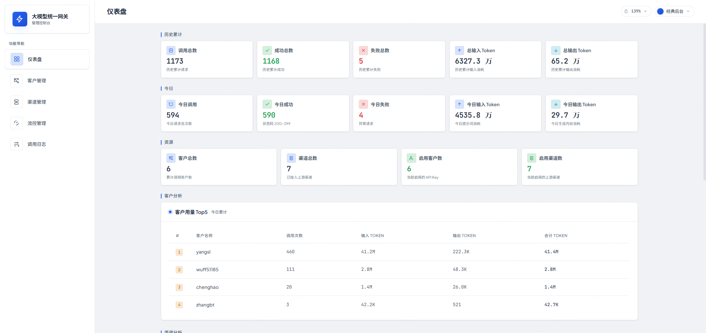
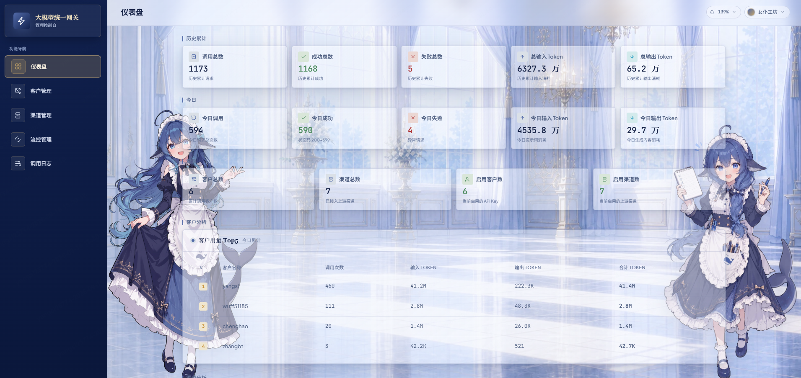
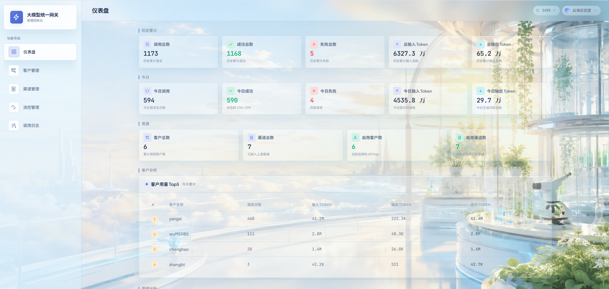
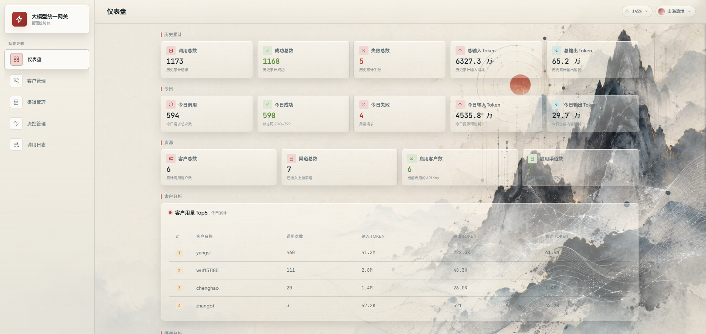
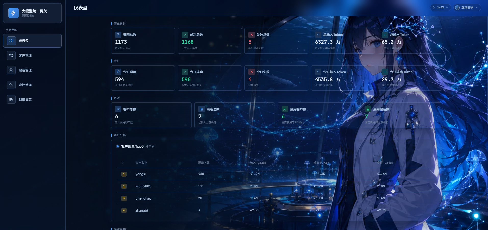
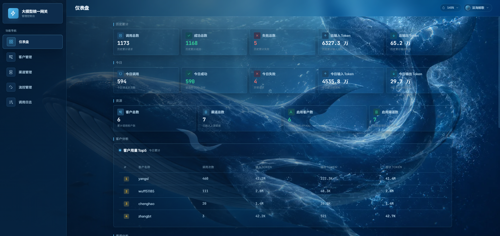

<div align="center">

# X-Gate-AI

**统一大模型网关 · 一个地址接入所有模型**

<p>
<a href="https://www.oracle.com/java/technologies/downloads/"></a>
<a href="https://spring.io/projects/spring-boot"></a>
<a href="https://baomidou.com/"></a>
<a href="https://www.sqlite.org/"></a>
<a href="LICENSE"></a>
</p>

面向 **OpenAI 兼容协议** 的统一模型网关：将 DeepSeek、通义千问、OpenAI、vLLM 本地推理等上游大模型服务收拢到一个固定 API 地址，通过 Web 控制台动态调度、免重启切换。

<p>
<a href="#-为什么选择-x-gate-ai"><kbd>为什么选择</kbd></a>
<a href="#-效果预览"><kbd>效果预览</kbd></a>
<a href="#-支持范围"><kbd>支持范围</kbd></a>
<a href="#-快速开始"><kbd>快速开始</kbd></a>
<a href="#-部署与数据"><kbd>部署与数据</kbd></a>
<a href="#-web-控制台"><kbd>Web 控制台</kbd></a>
</p>

</div>

---

## 💡 为什么选择 X-Gate-AI

<blockquote style="background:#ddf4ff;border-left:4px solid #0969da;border-radius:8px;padding:12px 16px;color:#1f2328">
💡 <b style="color:#0969da">应用只需配置一个地址</b><br>
服务商、API Key、模型名与路由策略，全部在控制台里完成。
</blockquote>

<table width="100%" style="width:100%">
<tr>
<td width="50%" valign="top">
<b>🔌 统一入口，保留原生协议</b><br>
客户端继续使用 OpenAI 兼容接口，OpenAI SDK、Cherry Studio、Dify 及各类 Agent 框架可直接接入，无需改造代码
</td>
<td width="50%" valign="top">
<b>🔄 多上游调度与故障转移</b><br>
一个模型通道可绑定多个上游，按失败计数排序轮询调度；连接失败自动切换下一个可用上游，全部失败才返回错误
</td>
</tr>
<tr>
<td width="50%" valign="top">
<b>⚡ 零重启热切换</b><br>
新增 / 编辑 / 启停上游、调整通道绑定均在控制台完成，即时生效
</td>
<td width="50%" valign="top">
<b>📊 全链路可观测</b><br>
调用日志、Token 用量、延迟与 HTTP 状态一目了然，日志按天滚动自动清理
</td>
</tr>
<tr>
<td width="50%" valign="top">
<b>🔐 轻量自持，开箱即用</b><br>
服务与控制台合并为单个 JAR；SQLite 单文件数据库无外部依赖，首次启动自动建库建表；上游 Key 加密存储
</td>
<td width="50%" valign="top">
<b>🎨 多主题控制台</b><br>
内置 6 套皮肤一键切换（含深色主题），支持角色立绘与玻璃浓度调节
</td>
</tr>
</table>

---

## 🖼️ 效果预览

<p align="center"><sub>点击图片查看完整尺寸</sub></p>

<table width="100%" style="width:100%">
<tr>
<td align="center" width="50%">
<a href="src/main/resources/static/preview/classic.png"></a>
<br><sub><b>经典后台</b></sub>
</td>
<td align="center" width="50%">
<a href="src/main/resources/static/preview/maidAtelier.png"></a>
<br><sub><b>女仆工坊</b></sub>
</td>
</tr>
<tr>
<td align="center" width="50%">
<a href="src/main/resources/static/preview/cloudLab.png"></a>
<br><sub><b>云海实验室</b></sub>
</td>
<td align="center" width="50%">
<a href="src/main/resources/static/preview/inkAlgorithm.png"></a>
<br><sub><b>山海算境</b></sub>
</td>
</tr>
<tr>
<td align="center" width="50%">
<a href="src/main/resources/static/preview/deepseekChan.png"></a>
<br><sub><b>深海回响</b></sub>
</td>
<td align="center" width="50%">
<a href="src/main/resources/static/preview/deepseaWhale.png"></a>
<br><sub><b>深海鲸歌</b></sub>
</td>
</tr>
</table>

<blockquote style="background:#f5efff;border-left:4px solid #8250df;border-radius:8px;padding:12px 16px;color:#1f2328">
🎨 <b style="color:#8250df">皮肤说明</b><br>
「女仆工坊」会在页面两侧注入角色立绘，顶栏提供玻璃浓度调节滑块，可实时调整卡片不透明度（0%–300%），效果持久化到 localStorage。
</blockquote>

---

## 🧩 支持范围

### 客户端协议

| 协议 | 入口 |
|---|---|
| OpenAI Chat Completions | `POST /v1/chat/completions`（流式 / 非流式） |
| OpenAI Embeddings | `POST /v1/embeddings` |
| OpenAI Models | `GET /v1/models` |

所有接口与 OpenAI 官方协议完全兼容，客户端零改造接入。

### 上游渠道

| 类型 | 服务 |
|---|---|
| 官方与云平台 | OpenAI、DeepSeek、通义千问 |
| 本地推理 | vLLM 及任意 OpenAI 兼容推理引擎 |
| 自定义 | 任意符合 OpenAI API 协议的上游服务 |

---

## 🚀 快速开始

### 1. 环境要求

| 依赖 | 版本 | 说明 |
|---|---|---|
| JDK | 17+ | 运行必需 |
| Maven | 3.6+ | 仅构建需要，运行只需 JAR |

### 2. 构建与运行

```bash
mvn clean package -DskipTests
java -jar target/x-gate-ai-1.0.0.jar
```

### 3. 访问入口

| 入口 | 地址 |
|---|---|
| Web 控制台 | <http://localhost:8090/> |
| 对外 API（OpenAI 兼容） | <http://localhost:8090/v1> |
| 数据库文件 | `./x-gate-ai.db`（JAR 同级目录，首次启动自动创建） |

<blockquote style="background:#e6f6ec;border-left:4px solid #1a7f37;border-radius:8px;padding:12px 16px;color:#1f2328">
💡 <b style="color:#1a7f37">端口说明</b><br>
默认端口 <code>8090</code>，可通过 <code>--server.port=8080</code> 或环境变量 <code>SERVER_PORT</code> 覆盖。
</blockquote>

### 4. 首次配置

1. 打开 Web 控制台，进入 **「渠道管理」** 添加上游大模型服务（填入 `base_url`、`api_key`、模型名）
2. 进入 **「客户管理」** 创建 API Key，配置对外模型名与路由策略
3. 将控制台生成的 **Base URL** 与 **Access Key** 交给应用端即可接入

---

## 📦 部署与数据

Java 服务与 Web 控制台合并为单个可执行 JAR，SQLite 单文件数据库，无外部依赖，首次启动自动建库建表。

<blockquote style="background:#ffebe9;border-left:4px solid #cf222e;border-radius:8px;padding:12px 16px;color:#1f2328">
⚠️ <b style="color:#cf222e">密钥安全</b><br>
<code>gateway.encrypt-key</code> 用于加密上游 API Key。生产环境务必通过环境变量 <code>XGATE_ENCRYPT_KEY</code> 覆盖默认值；密钥丢失或被替换后，已有加密凭据无法恢复。
</blockquote>

<details>
<summary><b>核心配置项</b>（点击展开）</summary>

| 配置项 | 默认值 | 说明 |
|---|---|---|
| `server.port` | `8090` | 服务端口 |
| `spring.datasource.url` | `jdbc:sqlite:./x-gate-ai.db` | SQLite 数据文件位置 |
| `gateway.time-out-of-minutes` | `3` | 上游调用超时（分钟） |
| `gateway.log-retention-days` | `30` | 调用日志保留天数，按天滚动清理 |
| `gateway.encrypt-key` | `xgate-ai-encrypt-2026` | 上游 api_key 加密密钥，**生产环境务必覆盖** |

</details>

### 数据表

| 表 | 说明 |
|---|---|
| `upstream_provider` | 上游供应商账号（名称、base_url、api_key、启停） |
| `upstream_model` | 供应商下挂载的模型（渠道绑定、失败计数、最大并发） |
| `customer` | 对外接入凭证（API Key、对外模型名、路由策略） |
| `call_log` | 调用日志（Token、延迟、HTTP 状态、时间） |

---

## 🖥️ Web 控制台

浏览器打开 <http://localhost:8090/> 即进入控制台。

<table width="100%" style="width:100%">
<tr>
<td width="50%" valign="top">
<b>📊 仪表盘</b><br>
历史累计与今日调用指标概览、客户用量 Top5、模型调用权重排行
</td>
<td width="50%" valign="top">
<b>👥 客户管理</b><br>
维护 API Key（客户）、查看接入 BaseURL 与 Access Key、按 model 精确匹配渠道
</td>
</tr>
<tr>
<td width="50%" valign="top">
<b>🧭 渠道管理</b><br>
维护各上游大模型的 <code>base_url</code> / <code>api_key</code>（加密存储）/ 模型名 / 启停
</td>
<td width="50%" valign="top">
<b>🚦 流控管理</b><br>
路由规则与并发控制，按优先级 + 触发条件决定请求最终落到哪个上游模型
</td>
</tr>
<tr>
<td colspan="2" valign="top">
<b>📜 调用日志</b><br>
按时间、客户名、模型、状态检索调用明细（Token、延迟、HTTP 状态）
</td>
</tr>
</table>

---

## 📄 许可

本项目基于 [Apache License 2.0](LICENSE) 开源。
