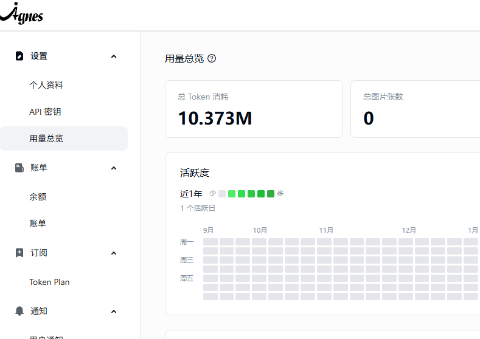

# X-Gate-AI 统一模型网关 — 技术方案设计

- 版本：v1.2
- 日期：2026-09-07
- 状态：评审中（对外 API 链路已按“OkHttp 原样透传、MVC 流式字节转发”重构落地）
- 参考工程：F:\hundsun\aigcbs\hsrcm-pbs-aigcbs（后端分层、MyBatis-Plus、SQLite 等风格对齐）

## 一、项目背景与目标

目前有多个零散的大模型服务（DeepSeek、通义千问、OpenAI、vLLM 本地等），各自拥有独立的 URL、Key、模型名，工具和业务系统需要逐个适配。

目标：搭建一个统一模型网关，实现：

1. 统一接入：所有上游大模型（OpenAI 兼容协议）统一纳入网关管理。
2. 统一出口：对外只暴露一个固定的 OpenAI 兼容 API 地址，所有工具只需配置这一个接口。
3. 动态管控：通过 Web 控制台动态实时切换背后模型的 URL、Key、模型名，无需重启、无需改动工具配置。
4. 单一部署：Java 服务与 Web 控制台合并部署，启动 Java 后 Web 自动可访问。

## 二、关键决策（已确认）

| 决策项 | 结论 |
|---|---|
| 对外 API 协议 | OpenAI 兼容格式 |
| 上游模型接入协议 | 全部为 OpenAI 兼容 |
| 对外鉴权 | 多 API Key + 用户管理 |
| 配置持久化 | 本地文件存储（SQLite） |
| 部署方式 | 单可执行 jar（前端打进 jar） |
| 对外端点范围 | /v1/chat/completions + /v1/embeddings + /v1/models |
| 多 Key 负载策略 | 轮询 + 故障自动切换 |
| 调用日志 | 需要日志与统计 |
| 限流 | 第一版暂不做 |
| 数据库访问 | MyBatis-Plus |

## 三、总体架构

```
                工具/客户端（OpenAI SDK、Cherry Studio、Dify、各类 Agent 框架）
                                    │
                                    ▼
                    对外统一 API（OpenAI 兼容）
              /v1/chat/completions /v1/embeddings /v1/models
                                    │
                    ┌───────────────┴───────────────┐
                    ▼                               ▼
          【对外 API + 鉴权 + 路由调度】      【Web 控制台】
                │ 轮询 / 故障转移 / 模型名映射          前端（vue.global + 静态资源）
                ▼                            (随 jar 一起发布)
        ┌────────┼────────┬────────┐
        ▼        ▼        ▼        ▼
   DeepSeek   通义千问   OpenAI    vLLM 本地    ...（任意 OpenAI 兼容服务）
```

核心链路：请求进入 → 鉴权 → 按对外模型名实时查库加载启用的上游候选（按 sort 排序 + 轮询旋转）→ 经共享 OkHttpClient 原样转发（仅替换请求体 model 字段）→ 上游 JSON / SSE 字节原样透传回调用方，失败自动切换下一个候选。

## 四、服务构成

整个项目为单一进程、单一 jar：

- 后端：Java 17 + Spring Boot 3.4.4（Spring MVC，Servlet 栈）
- 出站调用：OkHttp 4.12.0（统一 HTTP/SSE 客户端，共享连接池，超时取 gateway 配置）
- 前端：HTML + vue.global.prod.js（对齐参考工程 opsbridge 静态页方式），构建产物放入 resources/static
- 存储：SQLite 单文件数据库（sqlite-jdbc）
- 数据访问：MyBatis-Plus

启动方式：

```
java -jar x-gate-ai.jar
```

启动后：

- Web 控制台：http://localhost:8090
- 对外 API：http://localhost:8090/v1
- 数据库文件：x-gate-ai.db（jar 同级目录，首次启动自动创建）

## 五、技术栈与依赖（pom.xml，对齐参考工程）

### 5.1 Maven 坐标

```
groupId：com.xgateai
artifactId：x-gate-ai
java.version：17
```

### 5.2 Springboot 生态（版本由 spring-boot-dependencies 统一管理）

| 依赖 | 版本 |
|---|---|
| spring-boot-starter-web | 3.4.4 |
| spring-boot-starter-validation | 3.4.4 |
| spring-boot-starter-test | 3.4.4 |

### 5.3 开源框架

| 依赖 | 版本 |
|---|---|
| com.squareup.okhttp3:okhttp | 4.12.0 |
| com.baomidou:mybatis-plus-spring-boot3-starter | 3.5.11 |
| com.baomidou:mybatis-plus-jsqlparser-4.9 | 3.5.11 |
| org.xerial:sqlite-jdbc | 3.46.1.3 |

说明：

- 上游全部为 OpenAI 兼容协议：出站统一走 OkHttp，上游原始响应（JSON / SSE）字节透传，不引入任何模型 SDK 与反应式栈。
- MyBatis-Plus 使用 spring-boot3 专用 starter；自 3.5.9 起分页插件独立为 mybatis-plus-jsqlparser 模块（分页配置 DbType.SQLITE）。

### 5.4 常用工具（版本对齐参考工程）

| 依赖 | 版本 |
|---|---|
| cn.hutool:hutool-all | 5.8.47 |
| com.alibaba:fastjson | 2.0.64 |
| org.projectlombok:lombok | 1.18.46 |

### 5.5 构建插件

- maven-compiler-plugin：source/target 17，UTF-8
- spring-boot-maven-plugin：指定 mainClass，repackage 打成单 jar
- 前端产物通过 maven-resources-plugin 或构建脚本拷贝进 src/main/resources/static（与参考工程 static 目录一致）

## 六、代码风格规范（严格对齐参考工程）

### 6.1 类注释模板

```
/**
 * <p>
 * XxxController 模块描述
 * </p>
 *
 * @author xxx
 * @since 2026/9/4
 */
```

### 6.2 包结构（对齐参考工程 application + 业务模块 + bridge 分层）

```
com.xgateai
├── XGateAiApplication.java            # 启动类
├── gatewaybridge                      # 对外 API 网关链路
│   ├── adapter                        # ProxyAdapter：OkHttp 统一出站、JSON/SSE 原样透传、故障切换
│   ├── config                         # GatewayConfig / OkHttpConfig
│   ├── constant                       # GatewayConstant
│   ├── service                        # CallLogService / CallLogCleanTask（日志按天清理）
│   └── interceptor                    # ApiKeyInterceptor（/v1/** 鉴权拦截）
├── adminbridge                        # Web 控制台后端
│   ├── service                        # AdminService（上游/通道/绑定管理）
│   └── component                      # EncryptUtil（api_key AES 加解密）
├── application                        # 对外与公共层
│   ├── controller                     # GatewayController（/v1/**）+ AdminController（/admin/**）
│   ├── config                         # WebMvcConfig / MyBatisPlusConfig
│   ├── constant                       # CommonConstant
│   ├── exceptions                     # CommonException + GlobalExceptionHandler
│   ├── model
│   │   ├── dto                        # ChannelDTO / ProviderDTO
│   │   └── response                   # HttpResponse 统一返回
│   └── entity                         # 各表的 MyBatis-Plus 实体
├── mapper                             # MyBatis-Plus Mapper 接口
└── resources/static                   # Web 控制台前端（内嵌发布）
```

### 6.3 编写约定

- 注入统一使用 `@Resource`（jakarta.annotation.Resource），字段尽量 package-private。
- Service/Controller 使用 `@Slf4j` + `log.info / log.error` 打点，异常抛出 `CommonException(message, cause)`。
- Controller 加 `@RestController + @CrossOrigin + @RequestMapping`。
- DTO 使用 `@Data`，字段用 `@JsonProperty("xxx")` 显式标注，校验用 `@NotBlank(message = "提示词不能为空")` 风格。
- 统一返回 `HttpResponse`（code/message/result），静态工厂方法：object / objectForMessage / list / listForMessage / success / successForMessage / error。
- 实体使用 MyBatis-Plus 注解：`@TableName`、`@TableId(type = IdType.AUTO)`、`@TableField`。
- 配置类使用 `@Data + @Component + @ConfigurationProperties(prefix = "xxx")`。
- 常量集中到 CommonConstant，不散落魔法值。
- 候选上游每次请求实时查库加载（启用的绑定按 sort 升序），出站经共享 OkHttpClient，天然支持动态切换 baseUrl/apiKey/modelName。

## 七、模块设计

### 7.1 对外 API 模块（gatewaybridge）

| 端点 | 说明 |
|---|---|
| POST /v1/chat/completions | 对话补全，stream=true 时 SSE（text/event-stream）字节透传 |
| POST /v1/embeddings | 文本向量 |
| GET /v1/models | 返回当前调用 Key 所属通道的对外模型（OpenAI 模型列表结构） |

鉴权兼容性：同时支持 `Authorization: Bearer <key>` 与 `x-api-key: <key>` 两种传法。

### 7.2 管理 API 模块（adminbridge，供 Web 控制台）

- 管理员登录（用户名 + 密码，Session 鉴权）
- 上游 Provider 管理：增删改查、启停（baseUrl、apiKey、模型名）
- 对外模型通道管理：增删改查、启停、绑定多个上游、配置轮询
- 上游连通性测试：一键验证某 Provider 是否可用
- API KEY 管理：生成、禁用、删除
- 调用日志查询与统计

### 7.3 路由调度模块（核心）

对外模型名 → 一组上游 Provider 的映射，运行时执行：

1. 模型名映射：对外保持一个稳定模型名（如 flagship），仅把请求体 `model` 字段替换为上游真实模型名，其余字段原样透传。
2. 轮询：同一对外模型绑定多个上游时，启用的候选按 sort 升序排列，通道级 RoundRobin 旋转起点，天然负载均衡。
3. 故障自动切换：某个上游在连接建立阶段失败（连接超时 / 读超时 / 非 2xx / 401）时自动切换下一个候选重试，全部失败才返回错误；一旦上游已开始吐出字节（流式）则不再切换，避免半截 SSE 混流。

### 7.4 协议转换与模型调用

上游全部为 OpenAI 兼容协议。为遵循“先简单、够用再加”的原则，**网关不做任何协议中间翻译**，全部交给 ProxyAdapter 原样透传：

```
请求侧（rebindModel）：body.model = 上游真实模型名，其余字段原样
        │
        ▼
  共享 OkHttpClient（连接超时 10s / 读超时 gateway.time-out-of-minutes / 写超时 1min）
   POST {上游 baseUrl}/v1/chat/completions 或 /v1/embeddings
        │
        ▼
  非 2xx → 抛异常切换下一候选；2xx → 响应体原样返回调用方
  流式：Accept: text/event-stream → byteStream() 按 8KB 缓冲读取 → ServletOutputStream 原样写出
```

- 同步对话 / 向量：`postJson()` 读取完整响应体字符串，直接作为 Controller 响应返回。
- 流式对话：`streamOnce()` 逐块透传字节，SSE 数据不做解析、不重组、不伪造。
- 故障转移边界：连接建立阶段失败才切换候选；流已开始输出后对端断开则终止本次调用（不再换上游，避免混流）。

### 7.5 动态实时生效机制

- 上游候选每次请求实时查库加载（不设内存缓存层）：模型通道 → 启用的通道绑定（sort 升序）→ 启用的 Provider。
- 管理端任何修改直接落 SQLite，对外下一请求即可感知，改动即时生效、零重启。

### 7.6 鉴权模块

- 对外 API：实时校验 api_keys 表中的 Key 有效性 + 启用状态。
- 管理 API：Session 登录，默认账号 admin，首次启动生成随机密码（打印于启动日志，登录后强制修改）。

### 7.7 调用日志模块

每次调用记录：时间、调用 Key、对外模型、路由到的上游（URL+模型名）、耗时、输入/输出 token、HTTP 状态码。

Token 口径（不引入本地 tokenizer，均取上游口径）：

- 同步对话：解析上游返回 JSON 中的 `usage`（prompt_tokens / completion_tokens）；
- 流式对话：逐块扫描 SSE，捕获最后一个携带 `usage` 的数据行，流结束后落库；
- Embeddings：按请求 `input` 估算（字符串计 1，数组按元素个数）。

控制台按时间/模型/Key 筛选查询，仪表盘展示今日调用量、成功率、Token 消耗。日志表按天滚动保留最近 N 天（默认 30 天，可配置）。

## 八、数据模型（SQLite + MyBatis-Plus）

```
users              管理端用户(id, username, password_hash, created_at)
api_keys           对外调用Key(id, user_id, key, name, enabled, created_at, last_used_at)
upstream_providers 上游配置(id, name, base_url, api_key, model_name, enabled, remark)
model_channels     对外模型通道(id, public_model_name, enabled, strategy, remark)
channel_upstreams  通道-上游绑定(id, channel_id, provider_id, weight, sort)
call_logs          调用日志(id, api_key, public_model, upstream_url, upstream_model,
                          input_tokens, output_tokens, latency_ms, http_status, created_at)
```

说明：

- 实体类使用 MyBatis-Plus 注解映射，Mapper 接口继承 BaseMapper，分页使用 Page + PaginationInnerInterceptor(DbType.SQLITE)。
- 上游 api_key 使用 AES 加密后落库，密钥配置在 application.properties（支持环境变量覆盖）。
- 首次启动自动建表、初始化 admin 账号（建表 SQL 放 resources/db/schema.sql，启动时执行）。

## 九、Web 控制台（前端）

对齐参考工程 opsbridge 静态页方式：

- 前端为单 HTML + vue.global.prod.js + 少量脚本，无 node 构建链路，直接放 src/main/resources/static/xgateai/。
- 页面调用管理 API（同源，无需处理 CORS）。

页面清单：

1. 登录页
2. 仪表盘：今日调用量、成功率、Token 消耗趋势、启用模型数
3. 模型通道：对外模型列表，新增/编辑弹窗内可勾选多个上游、调权重、点击"测试"验证连通
4. 上游管理：Provider 列表（URL/Key/模型名），支持启停
5. API Key 管理：生成、复制、禁用、删除
6. 调用日志：筛选 + 分页列表，查看单次调用详情
7. 设置：修改密码、日志保留天数

## 十、配置与日志

### 10.1 application.properties（对齐参考工程分区块风格）

```
# ================================================================================
#                                服务基础配置
# ================================================================================
spring.application.name=x-gate-ai
server.port=8090
server.address=0.0.0.0
spring.jackson.date-format=yyyy-MM-dd HH:mm:ss
spring.jackson.time-zone=Asia/Shanghai

# ================================================================================
#                                  SQLite 数据库配置
# ================================================================================
spring.datasource.url=jdbc:sqlite:./x-gate-ai.db
spring.datasource.driver-class-name=org.sqlite.JDBC
# SQLite 单写者模型，Hikari 保持单连接避免锁竞争
spring.datasource.hikari.maximum-pool-size=1
# 启动执行建表脚本（幂等）
spring.sql.init.mode=always
spring.sql.init.schema-locations=classpath:db/schema.sql

# ================================================================================
#                                  MyBatis-Plus 配置
# ================================================================================
mybatis-plus.type-aliases-package=com.xgateai.application.entity
mybatis-plus.configuration.map-underscore-to-camel-case=true

# ================================================================================
#                                  网关配置
# ================================================================================
# 上游调用超时时间（单位：分钟）
gateway.time-out-of-minutes=3
# 日志保留天数
gateway.log-retention-days=30
# 上游 api_key 加密密钥（可通过环境变量覆盖）
gateway.encrypt-key=${XGATE_ENCRYPT_KEY:xgate-ai-encrypt-2026}
```

### 10.2 logback.xml（对齐参考工程）

- 控制台：彩色日志 %highlight()
- 文件：logs/application.log，按天滚动，保留 30 天

## 十一、构建与部署

```
构建：mvn clean package
产物：target/x-gate-ai.jar（前端已在 resources/static 内）
运行：java -jar x-gate-ai.jar
```

- 默认端口 8090，可在 application.properties 修改。
- 首次启动自动生成 x-gate-ai.db、admin 随机密码（控制台打印一次）。
- 升级部署只需替换 jar 文件，配置与日志保留在 db 文件中。

## 十二、开发里程碑

| 阶段 | 内容 | 验收标准 |
|---|---|---|
| M1 骨架 | 工程搭建、SQLite + MyBatis-Plus、admin 登录、管理端 CRUD | 控制台可增删改上游 |
| M2 对外 API | chat/embeddings/models + 鉴权 + OkHttp 原样透传 | curl 直连可对话 |
| M3 流式 | SSE 字节透传（OkHttp 读取 → ServletOutputStream 写出） | 工具中流式输出正常 |
| M4 路由 | 轮询 + 故障自动切换 | 拔掉一个 Key 自动切换下一个 |
| M5 日志 | 日志记录 + 仪表盘 + 日志页 | 调用可查可统计 |
| M6 收尾 | 单 jar 构建、首次初始化、文档 | java -jar 一条命令全跑通 |

## 十三、待确认细节

1. 工具侧当前主要使用哪些？（Cherry Studio / Dify / 自研？）以便按习惯做鉴权与兼容测试。
2. 上游 baseUrl 差异较大（有的带 /v1 前缀，有的不带），按"配置填完整 baseUrl、网关不再拼接"处理。
3. 是否需要多管理员 / 多租户？默认单管理员。

## 十四、风险与说明

- 第一版不做限流与配额，后续按需扩展。
- 上游服务稳定性依赖各 Provider 自身，网关提供失败自动切换兜底。
- 调用日志量大时注意 SQLite 性能，按天滚动清理控制数据量。
- 网关仅做“model 映射 + 字节透传”，不做 SSE 重组 / 本地 token 统计，最大限度降低对上游行为差异的假设；后续确有协议转换需求时再按需引入成熟 SDK。
