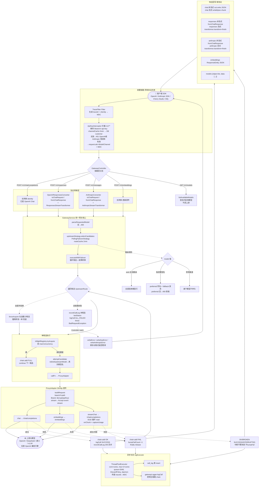

# X-Gate-AI 工程全链路设计全景

> 集中网关协议支持情况 + 客户端到上游的完整链路图。以代码为准整理，覆盖所有细节。
>
> ⚠️ 差异提示：`README.md` 的「客户端协议」表只列了 3 类（Chat/Embeddings/Models），但实际代码（最近两次提交 `fcf94c6 兼容anthropic的message协议`、`65bb759 兼容openai的response协议`）已经支持 **5 个协议入口**，README 没同步更新。本文以代码为准。

---

## 一、一共支持几种协议

**对外暴露 5 个协议入口，归为 3 大协议族**，内部统一以 OpenAI Chat 作为中间表示（中间态）：

| # | 协议族 | 入口方法 & 路径 | 流式 | 转换器 | 上游转发路径 |
|---|--------|----------------|------|--------|--------------|
| 1 | OpenAI Chat Completions | `POST /v1/chat/completions` | ✅ 流式+非流式 | 无（identity，已是中间态） | `/chat/completions` |
| 2 | OpenAI Responses | `POST /v1/responses` | ✅ 流式+非流式 | `OpenAIResponsesConverter` | `/chat/completions` |
| 3 | Anthropic Messages | `POST /v1/messages` | ✅ 流式+非流式 | `AnthropicConverter` | `/chat/completions` |
| 4 | OpenAI Embeddings | `POST /v1/embeddings` | ❌ 仅非流式 | 无（直接透传） | `/embeddings` |
| 5 | OpenAI Models | `GET /v1/models` | ❌ | 无（不走上游，查池内启用模型） | 不调上游 |

关键点：**协议 1/2/3 走统一网关链路（带故障转移），协议 4 走简化链路（无故障转移），协议 5 不调上游**。协议 2/3 入站时先转成 OpenAI Chat 请求体，出站时再把上游 Chat 响应/流式事件转回客户端协议格式。

---

## 二、所有协议共用的前置链路

无论哪个协议，请求进来都先过这两层（在 `GatewayController` 之前）：

```
HTTP 请求
  │
  ▼
[TraceFilter]（@Component, Servlet Filter, 全局 /*）
  ├─ 生成 traceId 写入 MDC（GatewayLog.putTraceId/newTraceId）
  ├─ 解析 clientIp（优先 X-Forwarded-For 首段）
  └─ finally: clearMdc()
  │
  ▼
[ApiKeyInterceptor]（WebMvcConfig 注册, addPathPatterns("/v1/**")）
  ├─ 非 HandlerMethod（静态资源等）→ 直接放行
  ├─ 解析 API Key：Authorization: Bearer xxx 优先，回退 x-api-key 头
  ├─ channelCache（Caffeine, maxSize=1000, 5min）查 ModelChannel
  │     未命中 → DB 查 customer 表 (api_key=? AND enabled=1, LIMIT 1)
  ├─ channel == null → 401，错误体按路径区分：
  │     • URI 以 /messages 结尾 → Anthropic 格式 {"type":"error","error":{"type":"authentication_error",...}}
  │     • 否则                 → OpenAI 格式   {"error":{"type":"invalid_request_error","code":"invalid_api_key",...}}
  └─ 命中 → request.setAttribute(ATTR_API_KEY, channel)
            + MDC 写 channelId / channelName / maskedKey(前4****后4)
  │
  ▼
[GatewayController]（@RequestMapping("/v1")）
```

---

## 三、5 种协议各自的链路

### 协议 1 — OpenAI Chat Completions  `POST /v1/chat/completions`

```
chatCompletions(rawBody)
  ├─ resolveChannel → null 则 400「无法识别调用方对客服务」
  ├─ JSON.parseObject 校验 → 空体 400
  ├─ body.stream == true ?
  │    ├─ YES → initSseResponse(text/event-stream, no-cache, keep-alive, flushBuffer)
  │    │        gatewayService.chatStream(channel, rawBody, writeBytes(out,chunk))
  │    │          catch ClientDisconnectedException → log.warn（中断不算失败）
  │    │          catch Exception → writeSseError(out, msg)  【data: {error}\n\n】
  │    └─ NO  → gatewayService.chat(channel, rawBody) → upstreamJson
  │             out.write(upstreamJson)  application/json
  └─ catch BadRequestException → writeError(status, errorCode, msg)
```

### 协议 2 — OpenAI Responses  `POST /v1/responses`

```
openaiResponses(rawBody)
  ├─ resolveChannel + JSON 校验（同上）
  ├─ chatBody = responsesConverter.toChatRequest(rawBody)   【入站：Responses→Chat】
  │     • input 三态（字符串 / messages 数组 / items 数组）→ chat messages
  │     • instructions → system；max_output_tokens → max_tokens
  │     • tools 扁平→嵌套 function；过滤内置工具(file_search/web_search…)
  │     • tool_choice 扁平→嵌套；reasoning.effort → reasoning_effort
  │     • text.format → response_format（json_schema 扁平→嵌套）
  │     • input items：message/function_call/function_call_output/reasoning(忽略)
  ├─ body.stream ?
  │    ├─ YES → initSseResponse
  │    │        transformer = responsesConverter.createStreamTransformer(model)
  │    │        gatewayService.chatStream(channel, chatBody, chunk ->
  │    │              bytes = transformer.transform(chunk);  【出站流式：Chat SSE→Responses 事件流】
  │    │              writeBytes(out, bytes))
  │    │        tail = transformer.finish() → writeBytes   【补发 response.completed + usage】
  │    └─ NO  → upstreamJson = gatewayService.chat(channel, chatBody)
  │             responsesJson = responsesConverter.fromChatResponse(upstreamJson)  【出站非流式】
  │             out.write(responsesJson)
```

### 协议 3 — Anthropic Messages  `POST /v1/messages`

```
anthropicMessages(rawBody)
  ├─ resolveChannel + JSON 校验（错误体走 Anthropic 格式）
  ├─ chatBody = anthropicConverter.toChatRequest(rawBody)   【入站：Anthropic→Chat】
  │     • 校验 model / messages / max_tokens(必填)
  │     • system(顶层, str|block数组) → 首位 system 消息
  │     • content blocks：text/image(→image_url)/tool_use(→tool_calls)/tool_result(拆 role=tool)
  │     • tools：input_schema → parameters；tool_choice 枚举映射(auto/any→required/tool/none)
  │     • thinking 块忽略（已知限制）
  ├─ body.stream ?
  │    ├─ YES → initSseResponse
  │    │        transformer = anthropicConverter.createStreamTransformer(model)
  │    │        gatewayService.chatStream(channel, chatBody, chunk ->
  │    │              bytes = transformer.transform(chunk);  【出站流式：Chat SSE→Anthropic 事件流】
  │    │              writeBytes(out, bytes))                  message_start→content_block_start→
  │    │        tail = transformer.finish() → writeBytes         delta×N→stop→message_delta→message_stop
  │    └─ NO  → upstreamJson = gatewayService.chat(channel, chatBody)
  │             anthropicJson = anthropicConverter.fromChatResponse(upstreamJson)  【出站非流式】
  │             out.write(anthropicJson)
  └─ 错误一律 writeAnthropicError（{"type":"error","error":{"type":...,"message":...}}）
```

### 协议 4 — OpenAI Embeddings  `POST /v1/embeddings`

```
embeddings(rawBody)
  ├─ resolveChannel + JSON 校验
  └─ gatewayService.embeddings(channel, rawBody)
        → ResponseEntity.ok().body(upstreamJson)   (application/json)
     catch BadRequestException → buildErrorResponse(400…)
```
> 注：Embeddings 不做协议转换、无 stream、无 Responses/Anthropic 对应，但仍走 `GatewayService` 的故障转移框架。

### 协议 5 — OpenAI Models  `GET /v1/models`

```
listModels()
  ├─ resolveChannel → null 则 400
  └─ data = gatewayService.listAvailableModels()
        ├─ upstream_model where enabled=1 order by model_name
        ├─ upstream_provider where enabled=1 → providerMap
        ├─ 遍历模型行，渠道存在才保留；按 model_name 去重
        └─ 组装 {id=model_name, object="model", created=epoch, owned_by=brandName(网关品牌名，不泄露真实供应商)}
     result = {object:"list", data}
     → ResponseEntity.ok().body(result)
```
> `auto` 是全池路由关键字，不在模型列表中返回。

---

## 四、统一上游链路（协议 1/2/3/4 共用，带故障转移）

这一段是协议 1/2/3 在 `GatewayService.chat / chatStream` 内、协议 4 在 `embeddings` 内走的同一段核心：

```
GatewayService.chat/chatStream/embeddings(channel, rawBody[, onChunk])
  │
  ├─ 1. parseRequestedModel(rawBody)
  │      model 为空 → throw BadRequestException("model 字段不能为空")  → Controller 400
  │
  ├─ 2. upstreamStrategy.selectCandidates(channel, model)   【PollingFailoverStrategy】
  │      cacheKey = channelId + ":" + model
  │      routeCache（Caffeine, maxSize=500, 2min）命中 → 直接返回候选列表
  │      未命中：
  │        • upstream_model where enabled=1 ORDER BY fail_count ASC, id ASC
  │        • upstream_provider where enabled=1 → channelMap
  │        • 组装 UpstreamRoute(provider, model)，丢弃渠道不存在/禁用的模型行
  │        • 路由规则：
  │            ┌─ model == "auto"(MODEL_POOL)  → 全部启用模型行（全池路由）
  │            ├─ 指定模型名                     → preferred(同名模型行) + fallback(其余)
  │            │                                   preferred 为空 → 400「池内暂无…模型」(不兜底)
  │            └─ 已禁用渠道下的模型不参与候选
  │        • 缓存 candidates
  │
  └─ 3. executeWithFailover(channel, model, body, stream, candidates, callFn, onChunk)
         chain = []   # 全链路调用记录
         for route in candidates:
           ├─ limit = maxConcurrencyOf(route.model)   # null/<=0 = 不限
           ├─ InflightRegistry.tryAcquire(modelId, limit)
           │     满 → chain.add(FULL, "已满n/limit") → continue 下一候选（不占额度）
           ├─ attemptCandidate(route, …):
           │     ├─ upstreamBody = rebindUpstreamModel(rawBody, route.modelName)  # 替换为真实模型名
           │     ├─ callFn.call(route, upstreamBody, onChunk):
           │     │     • chat:       proxyAdapter.chat(provider, body)        → respJson
           │     │     • chatStream: proxyAdapter.streamChat(provider, body, onChunk) → StreamResult
           │     │     • embeddings: proxyAdapter.embeddings(provider, body)  → respJson
           │     ├─ usage = parseUsageFromResponse(usageJson)
           │     ├─ ok = !stream || streamComplete
           │     │     chain.add(OK/BROKEN)；logCall(SUCCESS/INTERRUPTED)
           │     │     recordCallLog(route, usage, latency, 200) → call_log 表【异步】
           │     └─ return  非流式 respJson / 流式 null（数据已由 onChunk 写出）
           │   catch Exception:
           │     lastError=resolveMessage(e)；lastStatus=resolveUpstreamStatus(e)
           │     chain.add(FAIL, lastError)
           │     bumpFailCount(route) → upstream_model.fail_count + 1
           │   finally: inflightRegistry.release(modelId)
         # 全部候选并发已满（anyAttempted==false）：
         if 全满:
           route = 候选里 inFlight 最小者
           forceAcquire(modelId) → 强制转发一单（兜底，不校验上限）
           attemptCandidate …（失败同样 bumpFailCount）
         # 全链路失败：
           recordCallLog(末候选, lastStatus)
           logCall(ALL_FAILED, chain)
           throw BadRequestException("所有上游调用失败: "+lastError) → Controller 错误响应
```

`ProxyAdapter` 内部（OkHttp 透传）：

```
buildRequest(provider, path, body, stream):
  url    = provider.baseUrl + path            # path ∈ {/chat/completions, /embeddings}
  header Content-Type: application/json; charset=utf-8
  header Authorization: Bearer EncryptUtil.decrypt(provider.apiKey)
  if stream: header Accept: text/event-stream
  POST RequestBody.create(body, JSON_MEDIA_TYPE)

chat / embeddings → postJson → 非 2xx 抛 UpstreamException(msg, httpCode)
streamChat → execute → 非 2xx 抛 UpstreamException
            → InputStream.read(buf[8192]) 循环：
                onChunk.accept(chunk) → Controller 写 SSE（可能经 transformer.transform）
                captureUsage：抓最后一条 data:{…usage…} 行 → usageChunkJson
                ClientDisconnectedException → break（中断不算失败）
            返回 StreamResult{complete, usageChunkJson}
```

日志落库链路（异步，不阻塞主流程）：

```
logExecutor = ThreadPoolExecutor(core=max(2,cores), max=max(4,cores*2),
                                 queue=2048, DiscardPolicy, daemon, name=xgate-log-N)
submitLog(task):
  抓当前 traceId → 子线程 MDC.put(traceId) → task.run() → finally MDC.remove
  • recordCallLog: gatewayLogger.buildCallLogEntry → callLogDao.insert(call_log)
  • logCall:       gatewayLogger.logCall → 控制台/文件日志（含 chain 全链路）
线程池关闭/队列满 → 静默丢弃，不影响业务
```

---

## 五、完整链路大图（Mermaid）



---

## 六、关键设计细节（不漏的点）

1. **统一中间态**：所有对话类协议最终都是 OpenAI Chat 格式转上游，上游也要求 OpenAI 兼容。Embeddings/Models 不经 converter，直接透传/查询。
2. **候选粒度 = 模型行（`upstream_model`）**，不是渠道；同一渠道下不同模型彼此独立。`UpstreamRoute` = provider + model 组合。
3. **路由三态**：`auto`（全池）/ 指定模型名（优先段+兜底段）/ 池内不存在的模型名（直接 400 拒绝，避免任意模型名兜底命中）。
4. **故障转移**：按 `fail_count` 升序排候选 → 逐个 `tryAcquire` 并发额度 → 失败 `bumpFailCount` → 下一个；**全满则强制选在途最少者转发一单**；全失败抛 400。
5. **流式中断不算失败**：`ClientDisconnectedException`（客户端断开）走 INTERRUPTED，不触发 `bumpFailCount`，因为上游是好的。
6. **usage 抓取**：流式时 `ProxyAdapter.captureUsage` 抓最后一条含 `usage` 的 `data:` 行，供日志记录 token；转换器内部也会在 `message_start/message_delta`、`response.completed` 注入 usage。
7. **协议错误体分叉**：鉴权 401 在拦截器按 URI 是否以 `/messages` 结尾区分 Anthropic/OpenAI 错误体；Controller 层错误按入口分别走 `writeError`/`writeSseError`/`writeAnthropicSseError`/`writeAnthropicError`。
8. **缓存**：`channelCache`（API Key→客户，5min）、`routeCache`（channelId:model→候选列表，2min）。控制台改渠道/模型后靠 TTL 过期失效（注意代码里没看到主动 invalidate，热切换实际有最多 2min 延迟）。
9. **日志全异步**：独立 `logExecutor` 线程池 + DiscardPolicy，队列满静默丢日志，绝不阻塞主链路；traceId 跨线程透传。
10. **安全**：上游 `api_key` 用 `EncryptUtil` 加密存库，运行时解密；`owned_by` 统一回网关品牌名，不向上游暴露真实供应商。
11. **已知限制**（代码注释明确）：Anthropic `thinking`/`redacted_thinking` 块忽略；Responses 的 `previous_response_id`/`store`（服务端会话）忽略；`input_file` 文件输入不支持。

---

## 附：核心类索引

| 职责 | 类 |
|------|----|
| 对外控制器 | `controller/GatewayController.java` |
| 鉴权拦截器 | `interceptor/ApiKeyInterceptor.java` |
| 链路追踪过滤器 | `logging/TraceFilter.java` |
| 协议转换接口 | `protocol/ProtocolConverter.java`、`protocol/StreamTransformer.java` |
| Anthropic 转换器 | `protocol/AnthropicConverter.java` |
| OpenAI Responses 转换器 | `protocol/OpenAIResponsesConverter.java` |
| 协议类型枚举 | `protocol/ProtocolType.java` |
| 网关核心服务 | `service/gateway/GatewayService.java` |
| 路由策略接口 | `service/gateway/strategy/UpstreamStrategy.java` |
| 轮询故障转移策略 | `service/gateway/strategy/PollingFailoverStrategy.java` |
| HTTP 透传适配器 | `adapter/ProxyAdapter.java` |
| 并发在途计数器 | `component/InflightRegistry.java` |
| 日志记录器 | `logging/GatewayLogger.java` |
| 加密工具 | `component/EncryptUtil.java` |
| 缓存配置 | `config/CacheConfig.java` |
| 网关常量 | `constant/GatewayConstant.java` |
